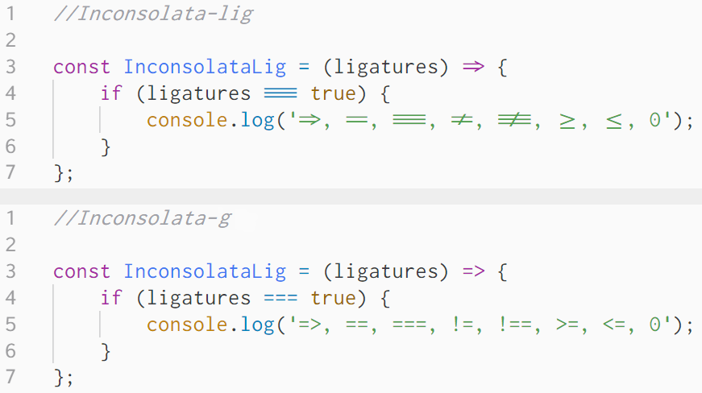

# Inconsolata-lig
Inconsolata-lig is a modified version of the [Inconsolata-g font](https://leonardo-m.livejournal.com/77079.html) with included programming ligatures.

## Changes from Inconsolata-g
- Fixed `0` dot's positioning to be better centered
- Symbol `=` moved up slightly to better accommodate `=>`
- Symbol `-` moved up slightly to align with `+` and `=`
- Added ligatures for: `=>, ==, ===, !=, !==, >=, <=`

Make sure your editor has font ligatures enabled to use the font to its fullest.